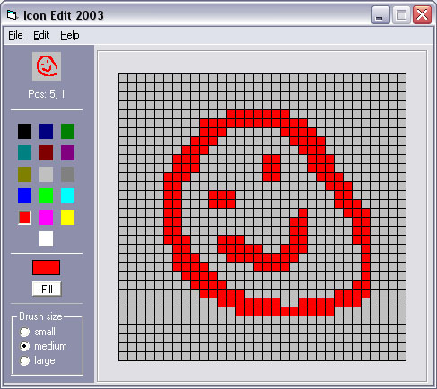



## nice and simple Icon Editor

### Description

Its a simple 32*32 icon editor with some basic editing functions.
 
### More Info
 

             |
---                |---
**Submitted On**   |2003-05-14 18:58:46
**By**             |[Matthew P](https://github.com/Planet-Source-Code/PSCIndex/blob/master/ByAuthor/matthew-p.md)
**Level**          |Beginner
**User Rating**    |4.6 (23 globes from 5 users)
**Compatibility**  |VB 3\.0, VB 4\.0 \(16\-bit\), VB 4\.0 \(32\-bit\), VB 5\.0, VB 6\.0
**Category**       |[Graphics](https://github.com/Planet-Source-Code/PSCIndex/blob/master/ByCategory/graphics__1-46.md)
**World**          |[Visual Basic](https://github.com/Planet-Source-Code/PSCIndex/blob/master/ByWorld/visual-basic.md)
**Archive File**   |[nice\_and\_s1588185152003\.zip](https://github.com/Planet-Source-Code/matthew-p-nice-and-simple-icon-editor__1-45498/archive/master.zip)

